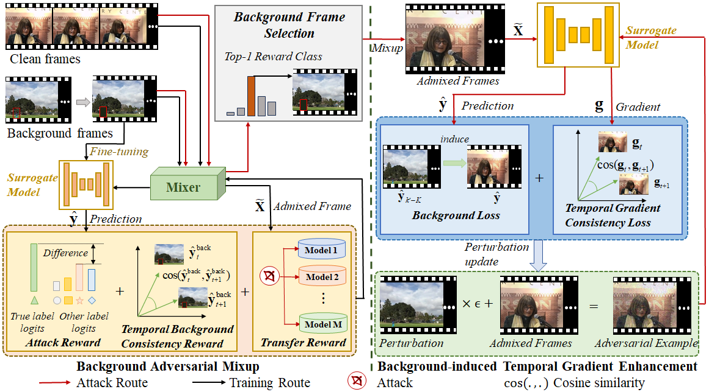
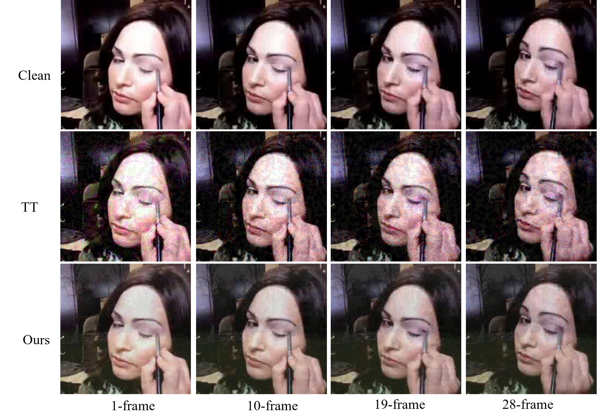
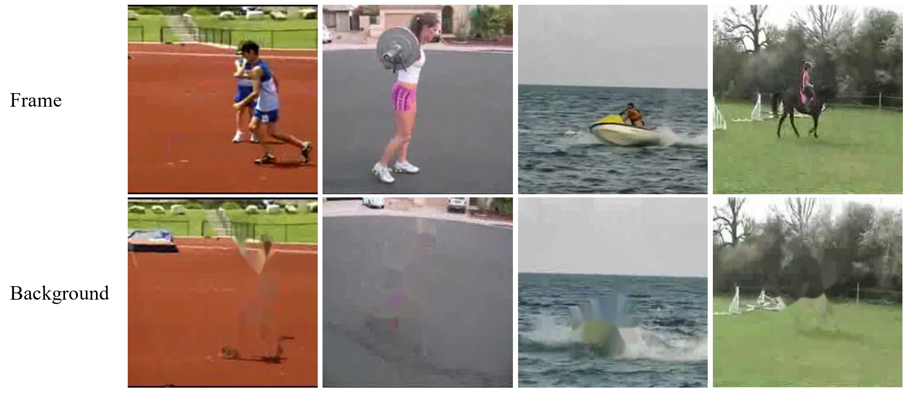

# README

# BMTC_Transfer-based Attack for Action Recognition

This repository is official PyTorch implementation code for IJCAI'25 paper:  **Temporal Consistency Constrained Transferable Adversarial Attacks with Background Mixup for Action Recognition**.

## **Abstract**

Action recognition models using deep learning are vulnerable to adversarial examples, which are transferable across other models trained on the same data modality. Existing transferable attack methods face two major challenges: 1) They heavily rely on the assumption that the decision boundaries of the surrogate (aka, source) model and the target model are similar, which limits the adversarial transferability; 2) Their decision boundary difference makes the attack direction uncertain, which may result in the gradient oscillation, weakening the adversarial attack. This motivates us to propose a **B**ackground **M**ixup-induced **T**emporal **C**onsistency (**BMTC**) attack method for action recognition.  From the input transformation perspective, we design a model-agnostic background adversarial mixup module to reduce the surrogate-target model dependency. In particular, we randomly sample one video from each category and make its background frame, while selecting the background frame with the top attack ability for mixup with the clean frame by reinforcement learning. Moreover, to ensure an explicit attack direction, we leverage the background category as guidance for updating the gradient of adversarial example, and impose a temporal consistency constraint onto the attack loss, which strengthens the stability of the attack direction on subsequent frames.  Empirical studies on two video datasets, i.e., *UCF101* and *Kinetics-400*, and one image dataset, i.e., *ImageNet*, demonstrate that our method significantly boosts the transferability of adversarial examples across several action/image recognition models.



## **Requirements**

The main runtime environment of the code:

```python
 python 3.8
 Pytorch 1.11.0
 CUDA 11.4

```

Install the libraries using requirements.txt as:

```python
 conda env create -f TemporalTranslation.yml

```

## **Dataset**

For action recognition, the used datasets are sampled from UCF101 and Kinetics-400. Download attacked datasets from [here](https://drive.google.com/drive/folders/1O4XyLw37WqGKqFvWFaE2ps5IAD_shSpG?usp=sharing). 
Change the **UCF_DATA_ROOT** and **Kinetic_DATA_ROOT** of utils.py into your dataset path.

For image recogition, download the data from [here](https://drive.google.com/file/d/1d-_PKYi3MBDPtJV4rfMCCtmsE0oWX7ZB/view?usp=sharing) into `/path/to/data`.

Then you should prepare the backgroundsets as follows:

```
cd Backgroundsets
python img_bg_extra.py
python img_bg_get.py
python flow_extract.py
python background_extract.py
```

```python
├──datasets
	├──UCF101
		├──UCF101-EXAMPLE
		├──frames
           	├──Backgroundsets
        ├──Kinetics400
		├──Kinetics400-EXAMPLE
           	├──frames
           	├──Backgroundsets
        ├──ImageNet
		├──ImageNet-EXAMPLE
           	├──images
           	├──Backgroundsets
```

For UCF101 and Kinetices400 background extract, please refer to [ISOMER](https://github.com/DLUT-yyc/Isomer)

## Models
For action recognition, Non-local, SlowFast, TPN with ResNet-50 and ResNet-101 as backbones are used here.

For image recognition, [ResNet-18](https://arxiv.org/abs/1512.03385), [ResNet-101](https://arxiv.org/abs/1512.03385), [ResNeXt-50](https://arxiv.org/abs/1611.05431), [DenseNet-121](https://arxiv.org/abs/1608.06993) are used here.
### UCF101
We fine-tune video models on UCF101.
Download checkpoint files from [here](https://drive.google.com/drive/folders/10KOlWdi5bsV9001uL4Bn1T48m9hkgsZ2?usp=sharing).
Change the **UCF_MODEL_ROOT** of utils.py into your checkpoint path.

### Kinetics-400
We use pretrained models on Kinetics-400 from [gluoncv](https://cv.gluon.ai/model_zoo/action_recognition.html) to conduct experiments.

## **Training & Testing**

Our code is mainly divided into two parts: train mixer and attack. Next, we will introduce the training and attack methods for these two parts in sequence.

### **1. Train mixer**

For action recognition 

```python
python Videos/train.py --model 'model_name' --background_sets '/path/to/background_sets'
```

For image recognition

```python
python Image/train.py --mixer 'model_name' --background_sets '/path/to/background_sets' --input_dir '/path/to/datasets/' --save_path '/path/to/save_path/' --mixer_surrogate 'surrogate_model_name'
```

### **2. Attack and Reference**

For action recognition 

```python
python Videos/BAM.py --model 'model_name' --background_sets '/path/to/background_sets' --mixer_path '/path/to/mixer_path' --mix_save_path '/path/to/mixer_save_path'

python BTG_ucf101.py --model 'model_name' --datasets_root '/path/to/datasets_root' --mixer_path '/path/to/mixer_path' --adv_save_path '/path/to/AdvExample_save_path'

python reference_ucf101.py --model 'model_name' --adv_path '/path/to/adv_path' --mixer_path '/path/to/mixer_path' --adv_save_path '/path/to/AdvExample_save_path'

```

For image recognition

```
scripts mixed_eval.sh
scripts ori_eval.sh
```


## Results

### 1. Quantitative results

**Performance Comparison Result in UCF101**
| Threat Models        | Attack Method | NL_resnet101 | NL_resnet50 | SlowFast_resnet101 | SlowFast_resnet50 | TPN_resnet101 | TPN_resnet50 |
|----------------------|---------------|:------------:|:----------:|:---------------:|:----------------:|:------------:|:------------:|
| NL_resnet101         | PGD           | 92.08        | 31.68       | 11.88              | 15.84             | 8.91          | 10.89        |
|                      | AA            | 94.05        | 28.71       | 17.82              | 20.79             | 12.87         | 11.88        |
|                      | TT            | 81.19        | 62.38       | 48.52              | 58.42             | 37.62         | 39.60        |
|                      | Ours          | 88.12        | 79.21       | 71.28              | 69.31             | 53.47         | 54.45        |
| SlowFast_resnet101   | PGD           | 17.82        | 23.76       | 93.07              | 36.63             | 9.90          | 14.85        |
|                      | AA            | 19.80        | 21.78       | 93.07              | 35.64             | 16.83         | 18.81        |
|                      | TT            | 54.46        | 62.38       | 80.10              | 52.48             | 36.63         | 38.61        |
|                      | Ours          | 73.26        | 78.22       | 86.14              | 71.29             | 52.47         | 66.34        |
| TPN_resnet101        | PGD           | 11.88        | 10.89       | 9.90               | 14.85             | 84.16         | 33.67        |
|                      | AA            | 13.86        | 17.82       | 10.89              | 18.81             | 89.11         | 24.75        |
|                      | TT            | 59.41        | 62.37       | 43.56              | 44.55             | 78.22         | 35.64        |
|                      | Ours          | 69.31        | 76.24       | 64.35              | 67.33             | 82.17         | 73.27        |


### 2. Qualitative results

**Adversarial Example in UCF101**



**Backgroundsets in UCF101**




## Citation

If you find this repo useful, please cite the following paper.

```
@inproceedings{li-ijcai2025-bmtc,
  author       = {Ping Li, Jianan Ni, Bo Pang},
  title        = {Temporal Consistency Constrained Transferable Adversarial Attacks with Background Mixup for Action Recognition},
  booktitle    = {Proceedings of the International Joint Conference on
                  Artificial Intelligence, (IJCAI)},
  year         = {2025},
}
```

## Contact

For any issues, please contact Mr. Ni Jianan via email njn@hdu.edu.cn

## **Acknowledgement:**

The implementation of this project is based on the codebases below.

[Trustworthy-AI-Group](https://github.com/Trustworthy-AI-Group/TransferAttack)

[TT](https://github.com/zhipeng-wei/TT)

If you find this project helpful, Please also cite the above codebases.